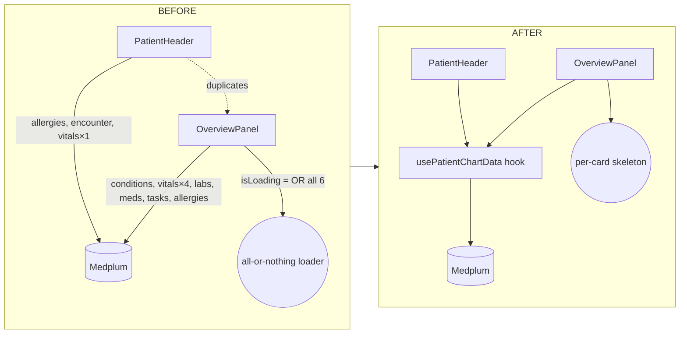

# P0 optimization pass — nursing-station UI

## Context

`apps/nursing-station/` has landed the first three P0 surfaces from `docs/analysis/clinician-ui-phased-roadmap.md` — PatientHeader (P0.1), chart shell / nav (P0.2), OverviewPanel (P0.3). A pass against the current code reveals concrete gaps the doctrine docs call out as acceptance criteria:

- **Perf:** `PatientHeader` and `OverviewPanel` each run their own `useSearchResources` queries, duplicating the `AllergyIntolerance` and vital-signs fetches. `OverviewPanel` gates the entire grid on a single `isLoading` OR-reduction, so all six cards wait on the slowest query.
- **Doctrine gaps:** header is not `position: sticky` (acceptance bar in the roadmap calls it out explicitly); `Code Status` is hardcoded to `'UNKNOWN'` in `PatientHeader.tsx:158`; two redundant nav controls render the same six chart sections (horizontal tab strip at the bottom of `PatientHeader` + left-rail `ChartSectionNav`); `TaskListPage` is a flat table, missing the assignment/worklist shape doctrine expects.
- **Code hygiene:** button/card primitives are copy-pasted inline across `App.tsx`, `PatientHeader.tsx`, `ChartSectionNav.tsx`, `OverviewPanel.tsx`; `tabs` + `navItems` arrays are re-allocated every render; `resolveObservationValue` is local to `OverviewPanel` but will be needed by Vitals/Labs tabs and future trend work.
- **Config / security:** `App.tsx:12-13` ships a hardcoded fallback client-id **and client-secret** in source; `MEDPLUM_BASE_URL` is duplicated between `main.tsx:16` and `SignInPage.tsx:13`.

This plan consolidates those into a single optimization pass without touching write semantics or doctrine scope (no new P0.4 Brain/worklist redesign, no P0.5 review/ack state, no agent-native work — those remain their own roadmap items).

### Doctrine reversal recorded

P0.3 plan Decision #4 (`docs/plans/p0.3-overview-page.md`) originally asserted: *"No cross-card state. Cards do not share fetches … the waste is tolerable (≤8 parallel queries on mount) and the isolation is worth it."* This optimization pass **supersedes** that decision — Medplum's `autoBatchTime: 100` batches the shared-hook reads into a single POST, so the isolation cost (duplicate `AllergyIntolerance`, duplicate vital-signs) outweighs the isolation benefit. Per-card *loading* isolation is preserved via Step 4's per-card skeletons; only the *fetch* layer is collapsed.

## Shape of the change



```
App.tsx ── sidebar NavButton ──┐
PatientChartPage ──┬── PatientHeader (sticky, no tab strip)
                   │      ├── Field (shared)
                   │      └── usePatientChartData
                   ├── ChartSectionNav (sole chart nav)
                   │      └── NavButton (shared)
                   └── tab panel
                          └── OverviewPanel
                                ├── ChartCard (shared)
                                └── usePatientChartData
```

## Critical files

- `apps/nursing-station/src/App.tsx` — config reads, navItems memo, NavButton
- `apps/nursing-station/src/main.tsx` — config import
- `apps/nursing-station/src/pages/SignInPage.tsx` — config import
- `apps/nursing-station/src/pages/PatientChartPage.tsx` — sticky header wiring, hoist `tabs`
- `apps/nursing-station/src/pages/TaskListPage.tsx` — narrow worklist shaping (fields + sort)
- `apps/nursing-station/src/components/PatientHeader.tsx` — sticky, drop tab strip, code-status from hook, consume `usePatientChartData`
- `apps/nursing-station/src/components/ChartSectionNav.tsx` — use shared `NavButton`
- `apps/nursing-station/src/components/OverviewPanel.tsx` — per-card skeletons, consume `usePatientChartData`, use shared `ChartCard`
- **New:** `apps/nursing-station/src/config.ts`
- **New:** `apps/nursing-station/src/hooks/usePatientChartData.ts`
- **New:** `apps/nursing-station/src/components/Field.tsx`
- **New:** `apps/nursing-station/src/components/NavButton.tsx`
- **New:** `apps/nursing-station/src/components/ChartCard.tsx`
- **New:** `apps/nursing-station/src/lib/observation.ts` (houses `resolveObservationValue`)
- **New:** `apps/nursing-station/src/lib/patient.ts` (houses `summarizeAllergies`, `derivePatientCodeStatus`, demographic format helpers)

## Step-by-step

### Step 1 — Config / security (fastest, isolated)

Create `src/config.ts`:

```ts
export const MEDPLUM_BASE_URL =
  import.meta.env.VITE_MEDPLUM_BASE_URL || 'http://10.0.0.184:8103/';
export const MEDPLUM_CLIENT_ID = import.meta.env.VITE_MEDPLUM_CLIENT_ID;
export const MEDPLUM_CLIENT_SECRET = import.meta.env.VITE_MEDPLUM_CLIENT_SECRET;
export const AUTO_LOGIN_ENABLED =
  import.meta.env.VITE_MEDPLUM_AUTO_LOGIN !== 'false';
```

Edits:

- `App.tsx:11-13,30` — import from `./config`. **Remove the hardcoded client-id and client-secret string literals.** When `AUTO_LOGIN_ENABLED && (!MEDPLUM_CLIENT_ID || !MEDPLUM_CLIENT_SECRET)`, set `autoLoginError` to `'VITE_MEDPLUM_CLIENT_ID / VITE_MEDPLUM_CLIENT_SECRET not set; auto-login disabled'` instead of calling `startClientLogin`. This preserves the existing fallback UX (manual sign-in form) without checking in a real secret.
- `main.tsx:15-20` — use `MEDPLUM_BASE_URL` from `./config`.
- `SignInPage.tsx:13` — use `MEDPLUM_BASE_URL` from `../config`.

### Step 2 — Shared data hook

Create `src/hooks/usePatientChartData.ts`:

```ts
import { useSearchResources } from '@medplum/react-hooks';
import type { /* ... */ } from '@medplum/fhirtypes';

export function usePatientChartData(patientId: string) {
  const ref = `Patient/${patientId}`;
  const [conditions, conditionsLoading] =
    useSearchResources('Condition', `patient=${ref}&_count=5`);
  const [vitals, vitalsLoading] =
    useSearchResources('Observation', `patient=${ref}&category=vital-signs&_sort=-date&_count=4`);
  const [labs, labsLoading] =
    useSearchResources('Observation', `patient=${ref}&category=laboratory&_sort=-date&_count=4`);
  const [meds, medsLoading] =
    useSearchResources('MedicationRequest', `patient=${ref}&_count=5`);
  const [tasks, tasksLoading] =
    useSearchResources('Task', `patient=${ref}&_sort=-authored-on&_count=5`);
  const [allergies, allergiesLoading] =
    useSearchResources('AllergyIntolerance', `patient=${ref}&_count=3`);
  const [encounters, encountersLoading] =
    useSearchResources('Encounter', `patient=${ref}&_sort=-date&_count=1`);
  const [codeStatusObs, codeStatusLoading] =
    useSearchResources('Observation', `patient=${ref}&code=45473-6&_sort=-date&_count=1`);

  return {
    conditions, vitals, labs, meds, tasks, allergies,
    encounter: encounters?.[0],
    latestVital: vitals?.[0],
    codeStatus: codeStatusObs?.[0],
    loading: {
      conditions: conditionsLoading,
      vitals: vitalsLoading,
      labs: labsLoading,
      meds: medsLoading,
      tasks: tasksLoading,
      allergies: allergiesLoading,
      encounter: encountersLoading,
      codeStatus: codeStatusLoading,
    },
  };
}
```

Key points:

- Call once in `PatientChartPage`, pass the whole object to `PatientHeader` and (for the overview tab) `OverviewPanel`. Medplum's existing `autoBatchTime: 100` in `main.tsx:15-20` will coalesce these into a single batched POST, and passing refs from the shared hook collapses the two duplicated `AllergyIntolerance` queries and the two vital-signs queries into one each.
- `latestVital: vitals?.[0]` is the single source of truth for the header's "Last Vitals" field — removes the header's standalone `_count=1` vital query.
- `codeStatus` uses LOINC `45473-6` (resuscitation status). If your dataset uses a different encoding, adjust — the hook is the single place to change.

### Step 3 — PatientHeader: sticky, shared Field, no tab strip, real code status

Edits to `PatientHeader.tsx`:

- **Props:** accept the `usePatientChartData` return value (or its subset: `allergies`, `encounter`, `latestVital`, `codeStatus`). Remove the three local `useSearchResources` calls on lines 79-81.
- **Sticky:** on the outer wrapper div (line 94), add `position: 'sticky', top: 0, zIndex: 3` and drop `position: 'relative'`. Keep the `borderBottom` and `background: colors.bg` so content doesn't bleed through.
- **Remove the horizontal tab strip** (lines 174-197) and the `sections` / `activeSection` / `onSelectSection` props — the left-rail `ChartSectionNav` is the sole chart nav, matching the doctrine "left rail OR strong chart nav" (not both). Update `PatientChartPage.tsx:33-40` to stop passing those props.
- **Code status:** replace `<Field label="Code Status" value="UNKNOWN" ... />` with a value derived by `derivePatientCodeStatus(codeStatus)` in `lib/patient.ts`, returning `'—'` when undefined. This satisfies the roadmap's "empty-state fields never render blank" acceptance check.
- **Extract `Field`:** move lines 50-68 to `src/components/Field.tsx` and import. Keep the same `data-testid` wiring.
- **Extract `summarizeAllergies`:** move to `lib/patient.ts` so OverviewPanel's gap logic can reuse it.

### Step 4 — OverviewPanel: per-card skeletons, shared primitives, gap alignment

Edits to `OverviewPanel.tsx`:

- **Consume the hook** (or accept chart data as props from `PatientChartPage`). Remove the six local `useSearchResources` calls.
- **Per-card skeletons:** delete the early-return `isLoading` branch (lines 101, 117-123). Each `<OverviewCard>` body renders `<Loader color={colors.accent} size="xs" />` when its own `loading[key]` is true, its data list when resolved, or the existing empty-state copy when resolved-and-empty. This unblocks fast-responding cards (e.g. Conditions) from slow ones (e.g. Tasks).
- **Extract `OverviewCard`** (lines 63-90) to `src/components/ChartCard.tsx` — same name is fine, but make it the shared chart-surface card so Results/MAR/Handoff panels can reuse it without copy-paste.
- **Move `resolveObservationValue`** (lines 12-39) to `src/lib/observation.ts`. Vitals/Labs tabs and any future trend-first work in `PatientChartPage.tsx:55-84` will reuse it.
- **Gap flags:** extend `gapFlags` to include `'Code status undocumented'` when `codeStatus` is undefined — keeps the gaps card consistent with the new header field.

### Step 5 — App.tsx + ChartSectionNav: shared NavButton, hoist arrays

- Create `src/components/NavButton.tsx` with a small variant prop (`'sidebar' | 'rail'`) that captures the three inline button styles currently in `App.tsx:94-114` and `ChartSectionNav.tsx:46-76`. Don't over-abstract — if the variant logic exceeds ~25 lines, keep two siblings (`SidebarNavButton`, `RailNavButton`) instead.
- `App.tsx`: hoist `navItems` (lines 66-69) to a module-level `const` outside `App`; it has no deps.
- `PatientChartPage.tsx`: hoist `tabs` (lines 21-28) to a module-level `const`. It's a static array today; make `activeTab` derivation read from it as before.

### Step 6 — TaskListPage narrow worklist shaping

The full P0.4 Brain-style worklist is its own roadmap item. For this pass, land only:

- Add `priority`, `status`, `businessStatus` to `fields` in the `SearchControl` (`TaskListPage.tsx:21`). Example: `fields: ['code', 'status', 'priority', 'for', 'authoredOn']`.
- Leave `sortRules` on `-authored-on`; full status/priority composite sort belongs to the P0.4 plan.
- Add `data-testid="task-list"` to the wrapping `div` for future Playwright anchoring.

### Step 7 — PatientListPage testid parity

- Add `data-testid="patient-list"` to the wrapping `div`. No behavior change.

## Non-goals (explicit, to avoid scope creep)

- No P0.4 Brain/worklist redesign.
- No P0.5 review/acknowledge state model.
- No P0.6 provenance / draft-final surface.
- No agent-native inline actions.
- No Medplum write-path changes.
- No Mantine styling overhaul — inline styles stay, only repeated ones get hoisted behind the shared components above.

## Verification

Run locally:

```
npm run lint --workspace apps/nursing-station
npm run build --workspace apps/nursing-station
npm run dev   --workspace apps/nursing-station
```

Manual browser checks at `http://localhost:3001`:

1. Sign-in loads. If `VITE_MEDPLUM_CLIENT_SECRET` is unset, `autoLoginError` surfaces a clear message (no silent failure, no secret in bundle — `grep -r 'be4fd04' apps/nursing-station/dist/` should return empty after build).
2. Patient list renders, click-through to `/Patient/:id` lands on Overview by default.
3. PatientHeader stays pinned at top when the right-hand tab content scrolls AND when the outer `AppShell.Main` scrolls (test by shrinking window height).
4. `Code Status` renders a real value or `'—'`, never `'UNKNOWN'`.
5. Chart nav is left-rail only — no duplicate horizontal tab strip in the header.
6. Overview cards resolve independently: open DevTools Network, filter to `/fhir/`, confirm the old duplicate `AllergyIntolerance?patient=...&_count=3` and duplicate `Observation?...vital-signs` requests are gone and each remaining request is batched. Slow cards show a spinner while fast cards render.
7. Task list shows the new status/priority columns; clicking a row with a `for` patient still navigates to that patient chart.

Playwright smoke:

```
npm run playwright:nursing-station:signin
```

Artifacts land under `artifacts/playwright/nursing-station-signin/`. Acceptance: sign-in page renders with the clearer auto-login-error message when secrets are absent, matching the doctrine note in `docs/analysis/clinician-ui-phased-roadmap.md` Phase C1.

## Follow-ups this plan intentionally leaves open

- P0.4 assignment/worklist (Brain-style clustering, due/overdue) — separate plan.
- P0.5 review vs acknowledge state model — separate plan, likely touches `clinical-mcp`.
- P0.6 provenance + draft/final review surface — depends on `docs/foundations/medplum-draft-review-lifecycle.md`.
- Playwright acceptance suite for sticky header + overview render — tracked in roadmap Phase C2.
